<a name="readme-top"></a>

<!-- PROJECT LOGO -->
<br />
<div align="center">
  <a href="https://deep-elegance-maker.netlify.app//">
    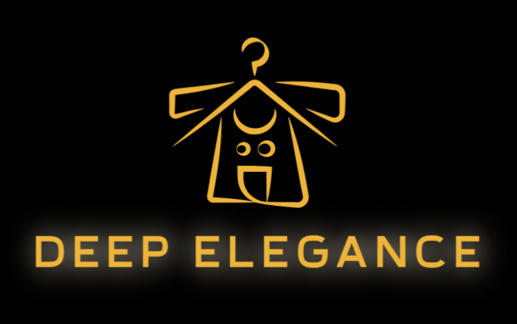
  </a>

  <h3 align="center">Deep elegance 3D t-shirt maker</h3>

  <p align="center">
    Web application for creating awesome 3D model t-shirts
    <br />
    <a href="https://github.com/mkulovac1/deep-elegance"><strong>Explore the docs »</strong></a>
    <br />
    <br />
    <a href="https://drive.google.com/file/d/1Gg6rOiAevORBpvTWVkN3M6aKk8eVURRq/view?usp=sharing">View Demo</a>
    ·
    <a href="https://github.com/mkulovac1/deep-elegance/issues">Report Bug</a>
  </p>
</div>

<!-- ABOUT THE PROJECT -->
## About The Project

<a href="https://deep-elegance-maker.netlify.app//">
  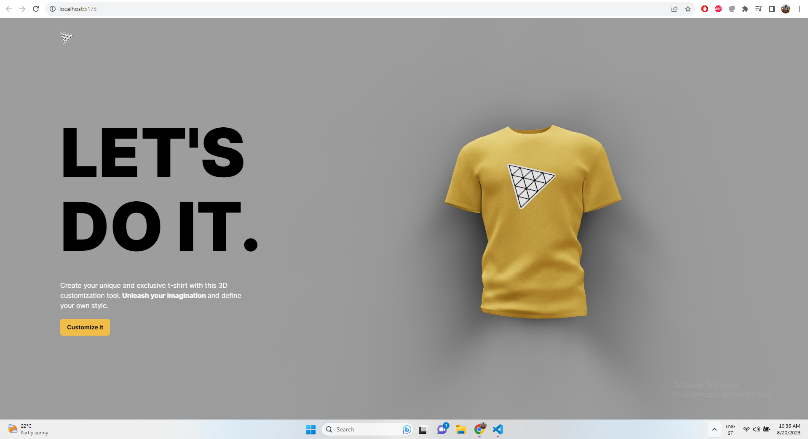
</a>
<p style="text-align: justify;">
  Deep elegance 3D t-shirt maker is a web application used to create custom t-shirts. With this application you can upload your logo that will be on the shirt. You can also upload an image that will cover the entire     surface of the shirt. It is possible to create a logo through "dall e 2" AI. You can change the color of the shirt itself, too. At the end, when you finish making your shirt, you can download it.    The application can be used on a mobile phone, tablet or computer (laptop).
</p>

<p align="right">(<a href="#readme-top">back to top</a>)</p>


## Demo

You can see a demo of this application on the following link: [CLICK ME](https://drive.google.com/file/d/1Gg6rOiAevORBpvTWVkN3M6aKk8eVURRq/view?usp=sharing)
<p align="right">(<a href="#readme-top">back to top</a>)</p>


## Deployment
You can see this project deployed on the link: [CLICK ME](https://deep-elegance-maker.netlify.app//)

<p align="right">(<a href="#readme-top">back to top</a>)</p>


## Built With

* React
* Tailwind CSS
* Express
* Node.js

<p align="right">(<a href="#readme-top">back to top</a>)</p>


<!-- GETTING STARTED -->
## Getting Started

To run this project locally you need to do following (prerequisites and installation).

### Prerequisites

* Visual studio code
* Node.js
* Dall e 2 OpenAI API key


### Installation

1. Clone the repo
   ```sh
   git clone https://github.com/mkulovac1/deep-elegance
   ```
2. ***Open this project in Visual studio code***
3. In server directory create file with name ".env" and in there enter your Dall e 2 OpenAI API key
   ```
   OPENAI_API_KEY = YOUR_API_KEY
   ```
4. Write this command in vscode terminal
   ```
   cd server
   ```
5. Install NPM packages through terminal
   ```
   npm install
   ```
6. Run express server (backend) through terminal
   ```
   npm start
   ```
7. ***Open new terminal in vscode***
8. Write this command in vscode terminal
   ```
   cd client
   ```
9. Install NPM packages through terminal
   ```
   npm install
   ```
10. Run application (frontend) through terminal
   ```
   npm run dev
   ```

<p align="right">(<a href="#readme-top">back to top</a>)</p>


<!-- USAGE EXAMPLES -->
## Usage

### Desktop

Here you can see examples of using app on **desktop** devices.

**Home page:**

<a href="https://deep-elegance-maker.netlify.app//">
  
</a>

**Customize page:**

<a href="https://deep-elegance-maker.netlify.app//">
  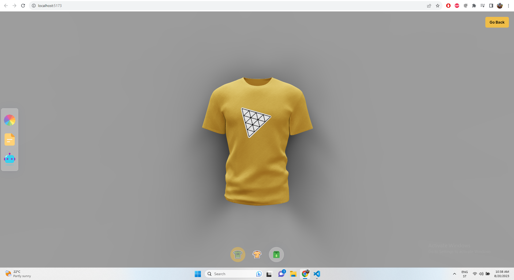
</a>

**Choosing t-shirt color:**

<a href="https://deep-elegance-maker.netlify.app//">
  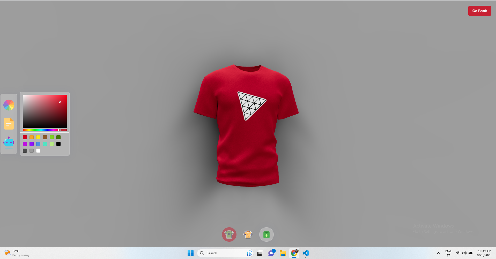
</a>

**Uploading logo image:**

<a href="https://deep-elegance-maker.netlify.app//">
  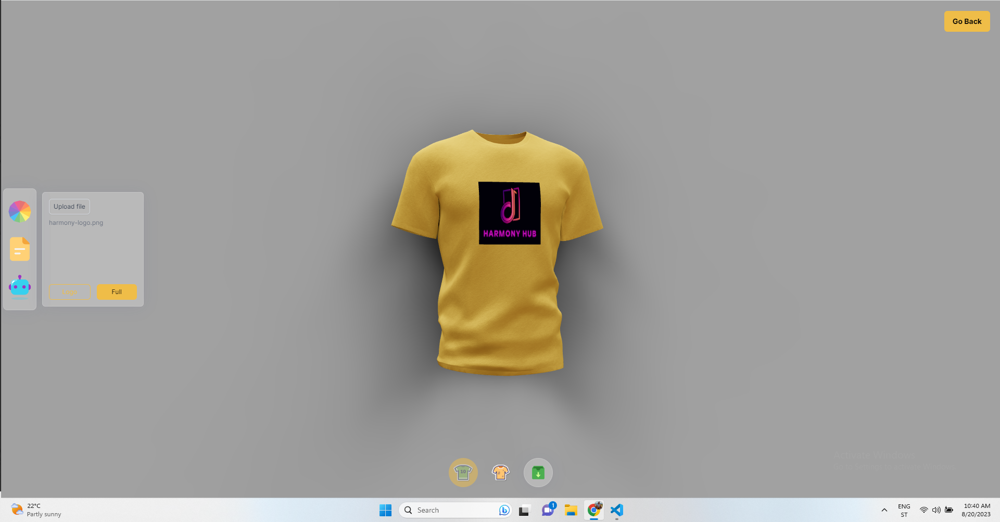
</a>

**Uploading full image:**

<a href="https://deep-elegance-maker.netlify.app//">
  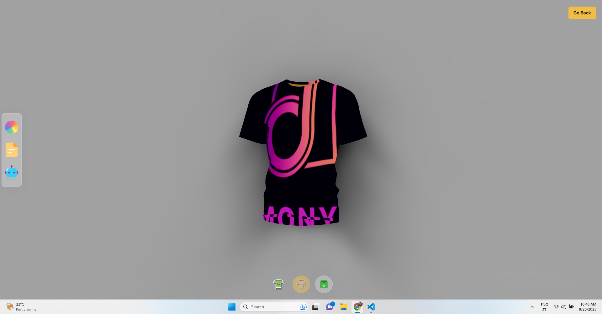
</a>

**Making logo with AI:**
<a href="https://deep-elegance-maker.netlify.app//">
  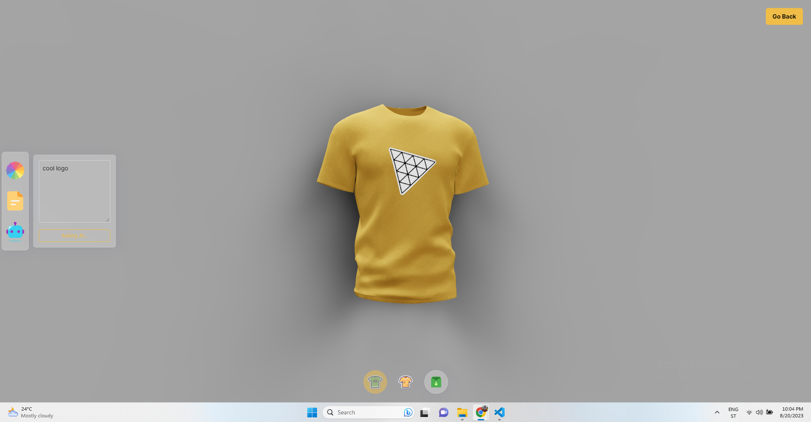
</a>

**Result:**

<a href="https://deep-elegance-maker.netlify.app//">
  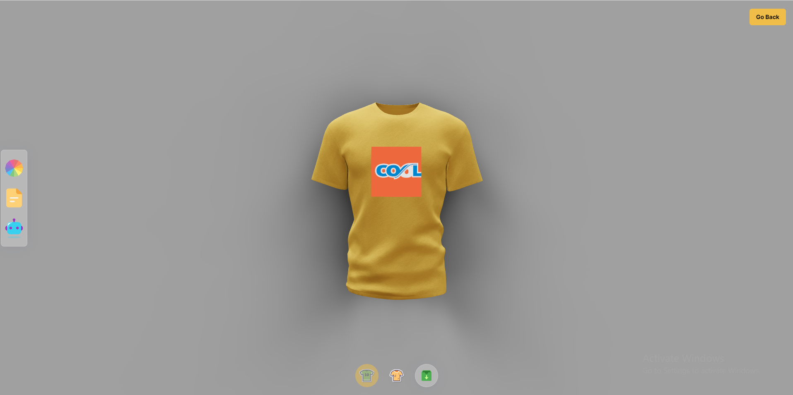
</a>

**Making full image with AI:**
<a href="https://deep-elegance-maker.netlify.app//">
  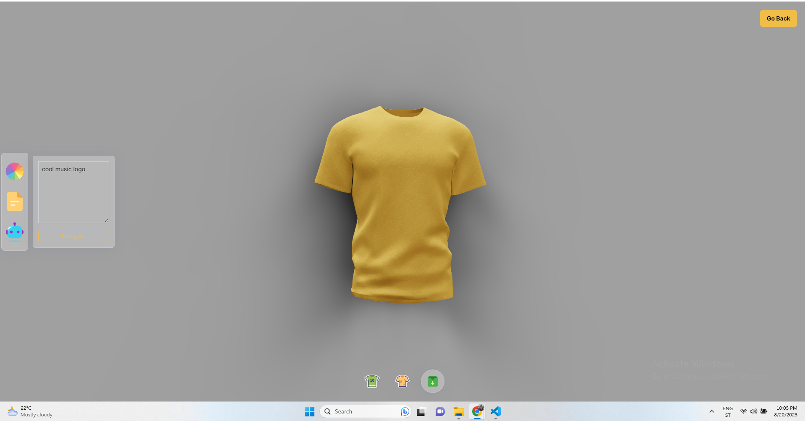
</a>

**Result:**

<a href="https://deep-elegance-maker.netlify.app//">
  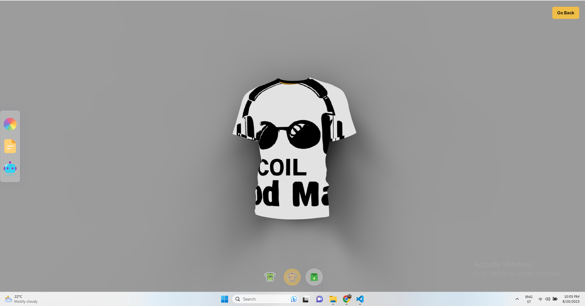
</a>

<p align="right">(<a href="#readme-top">back to top</a>)</p>

### Mobile

Here you can see examples of using app on **mobile** devices.

**Home page:**
<p align="center">
    <a href="https://deep-elegance-maker.netlify.app//">
      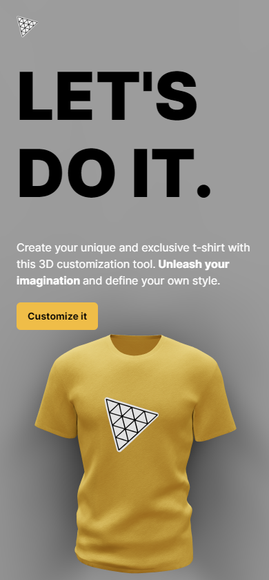
    </a>
</p>


**Customize page:**

<p align="center">
  <a href="https://deep-elegance-maker.netlify.app//">
    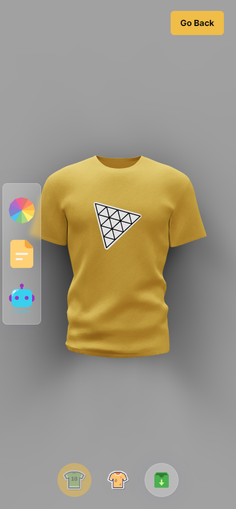
  </a>  
</p>


**Choosing t-shirt color:**
<p align="center">
  <a href="https://deep-elegance-maker.netlify.app//">
    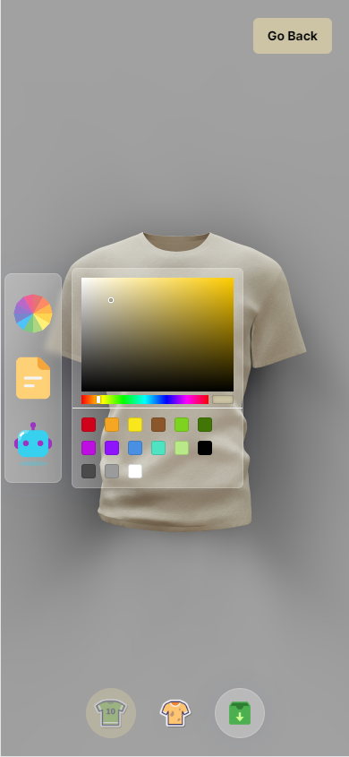
  </a>
</p>

**Uploading logo image:**

<p align="center">
  <a href="https://deep-elegance-maker.netlify.app//">
    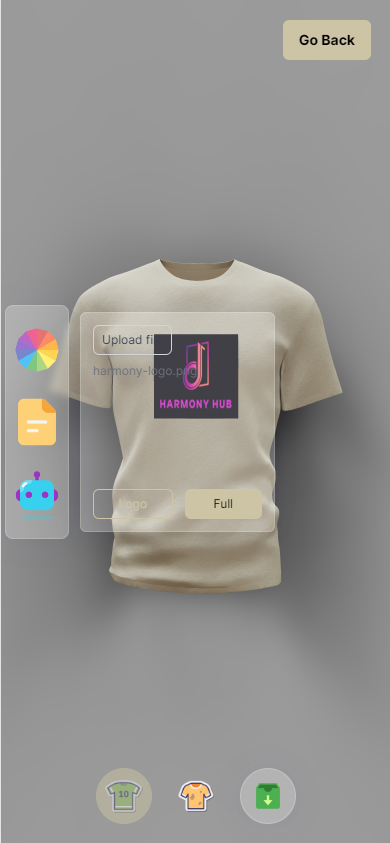
  </a>
</p>

**Uploading full image:**

<p align="center">
  <a href="https://deep-elegance-maker.netlify.app//">
    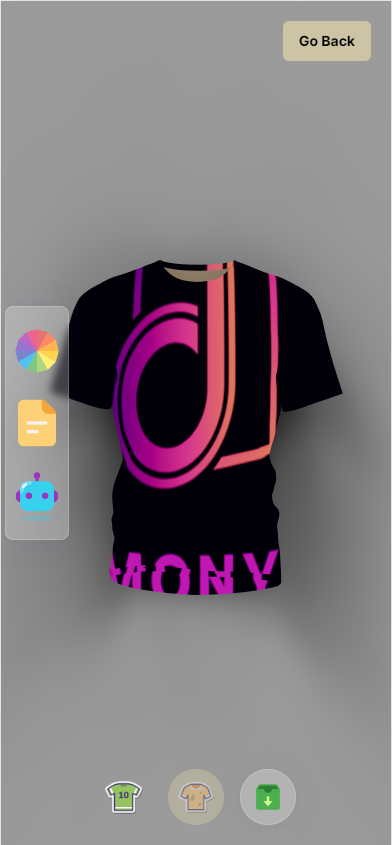
  </a>
</p>

**Making logo with AI:**
<p align="center">
  <a href="https://deep-elegance-maker.netlify.app//">
    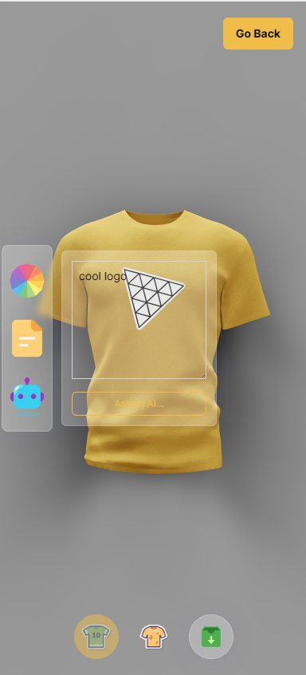
  </a>
</p>

**Result:**

<p align="center">
  <a href="https://deep-elegance-maker.netlify.app//">
    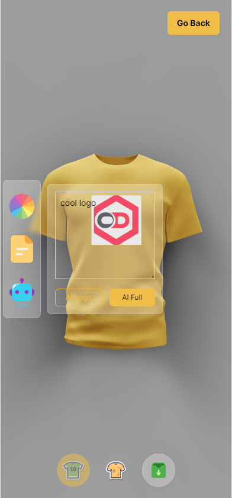
  </a>
</p>

**Making full image with AI:**
<p align="center">
  <a href="https://deep-elegance-maker.netlify.app//">
    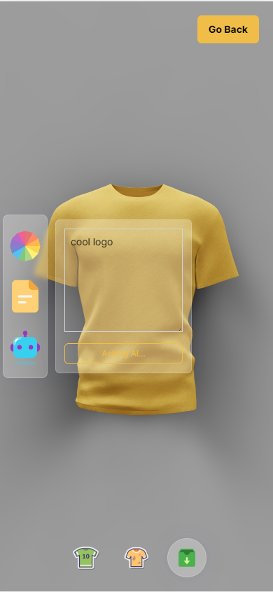
  </a>
</p>

**Result:**

<p align="center">
  <a href="https://deep-elegance-maker.netlify.app//">
    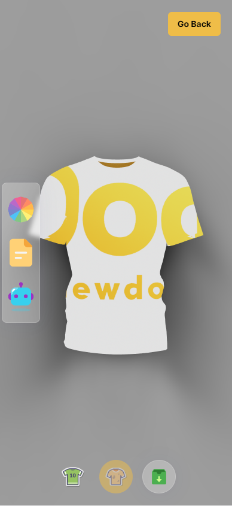
  </a>
</p>

_For more examples, please refer to the [Documentation](https://github.com/mkulovac1/deep-elegance/documentation)_

<p align="right">(<a href="#readme-top">back to top</a>)</p>


<!-- CONTRIBUTING -->
## Contributing

Contributions are what make the open source community such an amazing place to learn, inspire, and create. Any contributions you make are **greatly appreciated**.

If you have a suggestion that would make this better, please fork the repo and create a pull request. You can also simply open an issue with the tag "enhancement".
Don't forget to give the project a star! Thanks again!

1. Fork the Project
2. Create your Feature Branch (`git checkout -b feature/AmazingFeature`)
3. Commit your Changes (`git commit -m 'Add some AmazingFeature'`)
4. Push to the Branch (`git push origin feature/AmazingFeature`)
5. Open a Pull Request

<p align="right">(<a href="#readme-top">back to top</a>)</p>


<!-- CONTACT -->
## Contact

Merim Kulovac, [@merimkulovac](https://www.linkedin.com/in/merimkulovac/), e-mail: merim.kulovac@outlook.com

<p align="right">(<a href="#readme-top">back to top</a>)</p>
